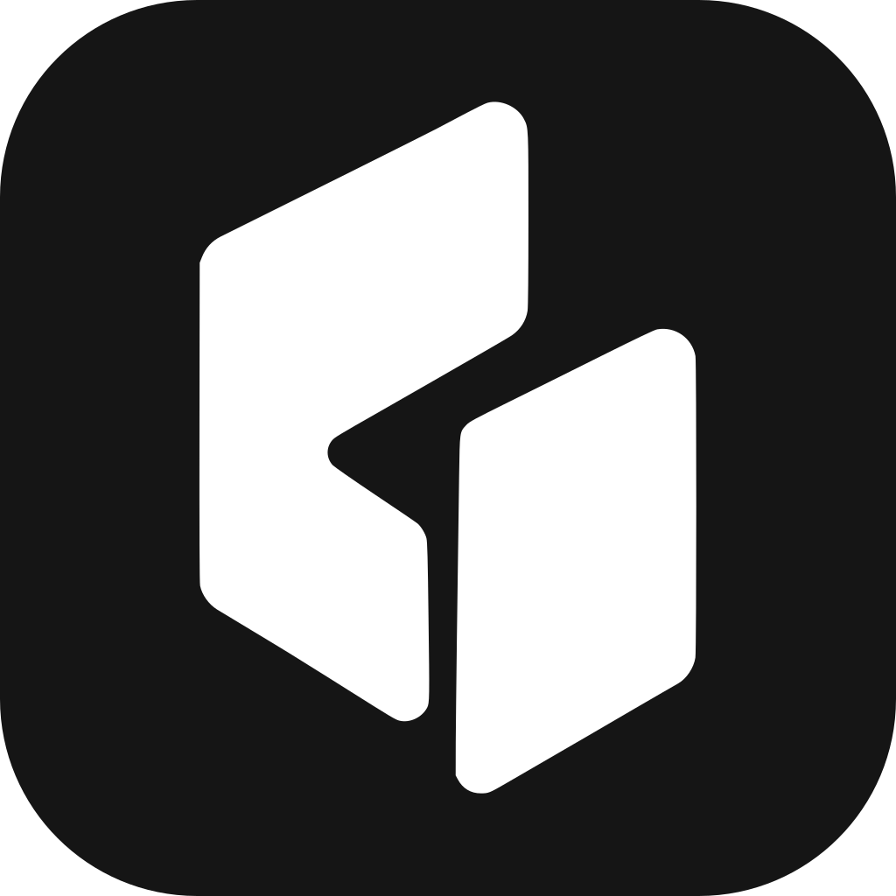

<p align="center"></p>

# Spindle

A focused, open-source workspace for directing coding agents. Run independent
threads, branch conversations into worktrees, route tasks to different models,
and follow their progress across desktop, web, and mobile.

Spindle is a fork of [T3 Code](https://github.com/pingdotgg/t3code), with additions
for agent-to-agent thread orchestration, checkpoint and compaction forks, task
visibility, Linear-driven worktrees, and multi-project workflows.

Works with your existing Claude Code, Codex, Cursor, Grok Build, OpenCode, and
Antigravity subscriptions. Install and authenticate a provider before starting work.

## Run from source

Install [Vite+](https://viteplus.dev/guide/), then:

```bash
git clone https://github.com/meik1998dev/t3code.git
cd t3code
vp i
vp run dev
```

Desktop builds live in the [fork's releases](https://github.com/meik1998dev/t3code/releases)
when published. See [installation](docs/user/install.md) for build options.

The upstream `npx t3`, package-manager listings, hosted website, and app-store
listings still distribute T3 Code, not Spindle. The existing `.t3` data directory,
`t3` CLI, package namespaces, and connection identifiers remain compatible.

## Documentation

Full docs live in [docs/](./docs). There's no docs site yet.

- [Install and first run](./docs/user/install.md)
- [Permission modes](./docs/user/permission-modes.md)
- [Keyboard shortcuts](./docs/user/keybindings.md)
- [Project settings](./docs/user/project-settings.md)
- [Remote access from a phone or another machine](./docs/user/remote-access.md)
- [Keeping app and server in sync](./docs/user/updating.md)
- [Source control integrations](./docs/user/source-control.md)
- [Linear](./docs/user/linear.md)
- Multiple accounts: [Codex](./docs/user/providers-codex.md) · [Claude](./docs/user/providers-claude.md)
- [Run Spindle as a background service](./docs/user/background-service.md)

Building from source? Start at [docs/internals/overview.md](./docs/internals/overview.md).

## Contributing

Read [CONTRIBUTING.md](CONTRIBUTING.md) for repository conventions. Report issues
with this fork in [meik1998dev/t3code](https://github.com/meik1998dev/t3code/issues).

## Acknowledgments

Built on T3 Code by T3 Tools and its contributors. Original copyright and MIT
license notices are preserved in [LICENSE](LICENSE).
